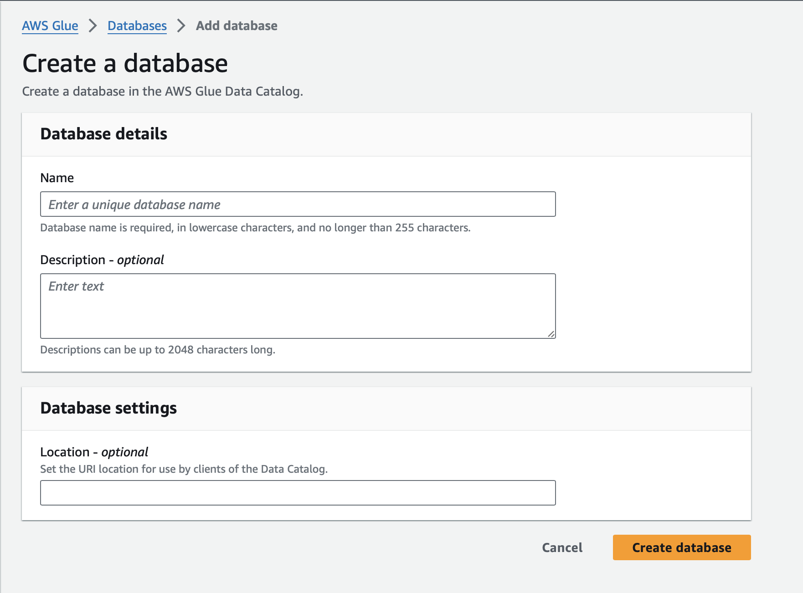
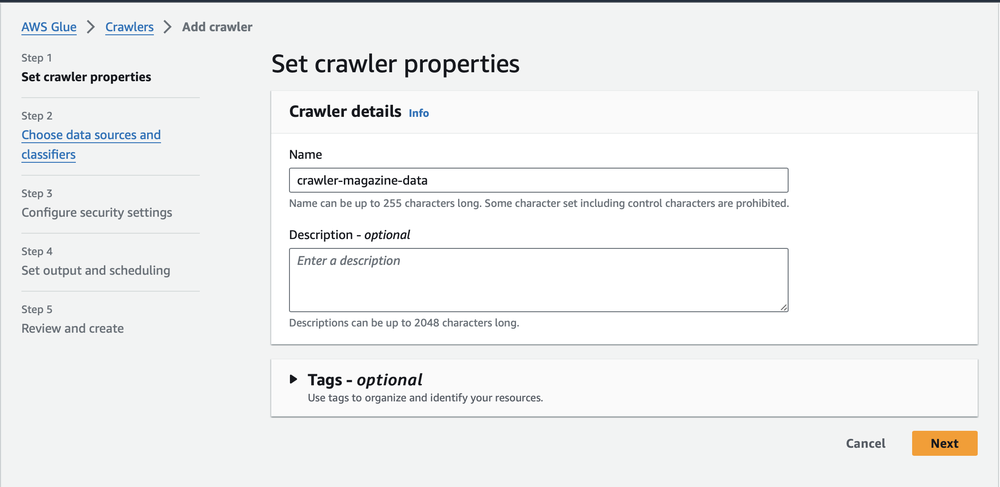
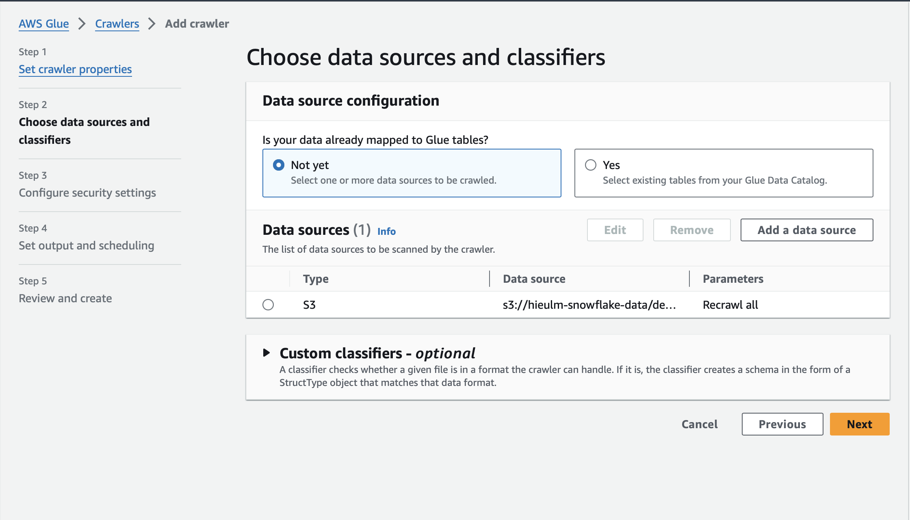
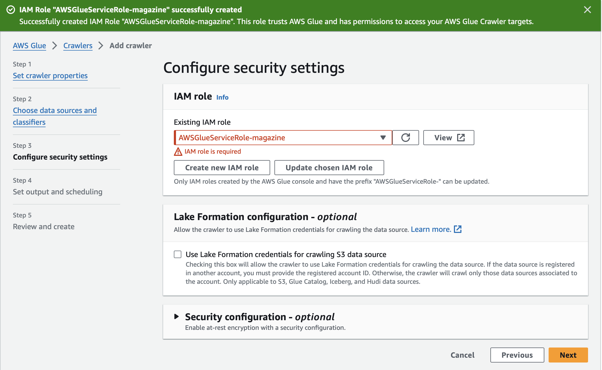
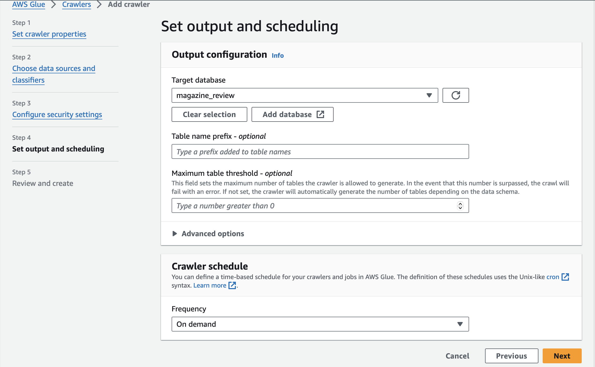
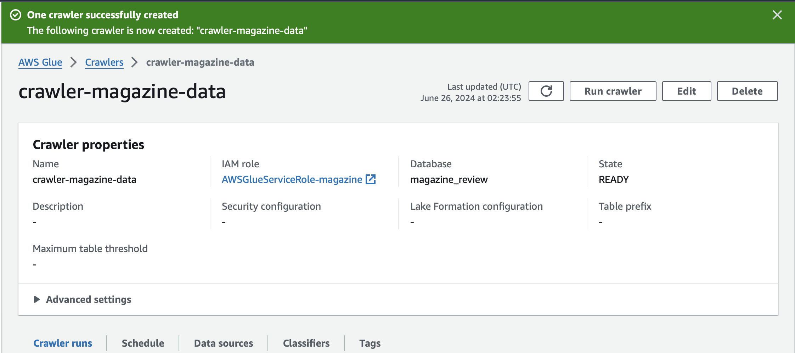
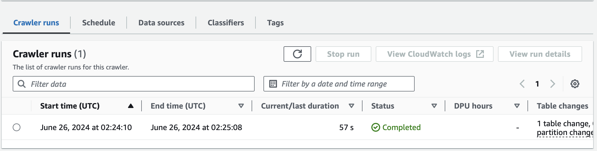
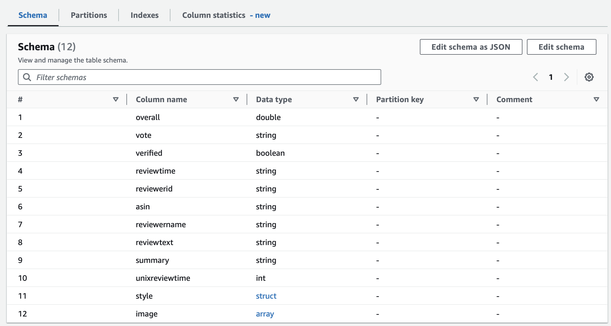
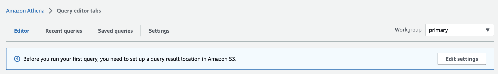

# aws-glue-crawler
Using AWS Glue Crawler to scan data in S3 Bucket to infer informations and schema of data. After that Using AWS Athena to query data

## Architecture

The architecture of the project to understand about AWS Glue,S3 ,AWS Athena

## Glue Crawler

First, I will create database in AWS Glue Data Catalog which is a central metadata repository where the schema information and other metadata for your data assets are stored. This metadata includes information about databases, tables, and columns.

**Create Glue Crawler**:

**Step 1**: Set up the name of the Crawler

**Step 2**: Choose data source from which Glue Crawler can scan data and infer the schema.

**Step 3**: Configure security settings. I create IAM role to have permissions to access the target source.

**Step 4**: Set up Output and Schedule.

In this step, I set up the target source (Glue Data Catalog) when Glue Crawler finish to have the information of the data source.

About Scheduling, I just chose '''On demand'''. It can be set based on cron expression to run it on specific time.

Done set up Glue Crawler will be liked that:

Then, I run this Crawler:

After, Glue Crawler finish, the schema will be recorded in Glue Data Catalog. It is a table named 'reviews' in database which I set up first.

The schema of the data source:

## AWS Athena

After, AWS Glue Crawler scans the data source and stores the information and metadata in AWS Glue Data Catalog, AWS Athena automatically connects to help you query the data using SQL.

**NOTE**: Before you can run the query you want, you need to set up the place to save the query run, I means set up S3 Bucket to save the query.

Finally, Here is the result after I use:

- S3 for saving raw data.
- AWS Glue Crawler to scan the data to get the information and metadata.
- Then, AWS Athena to retrieve the data source.

